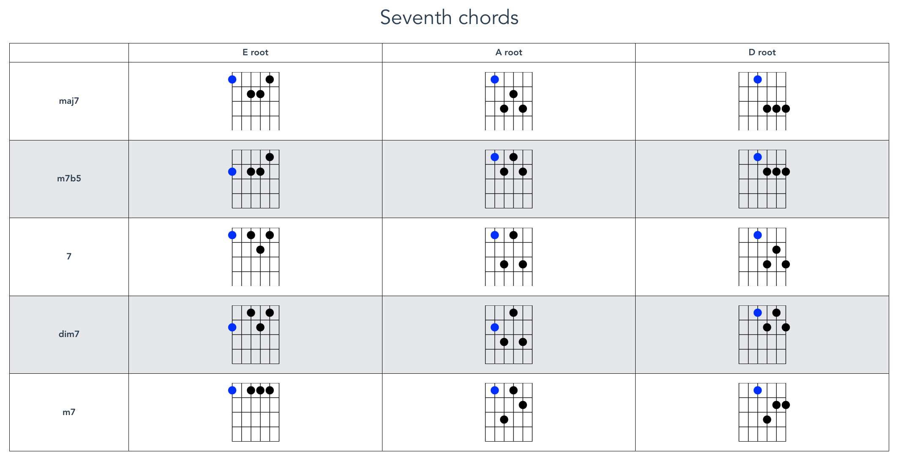
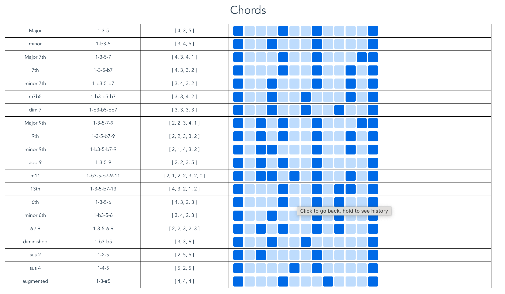
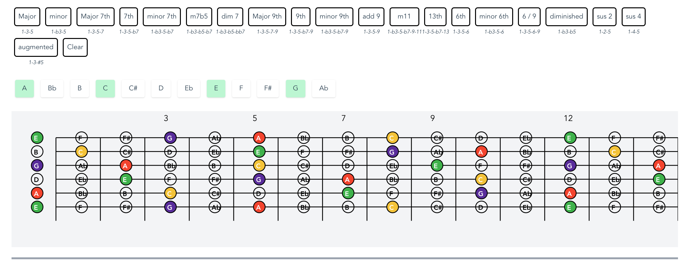
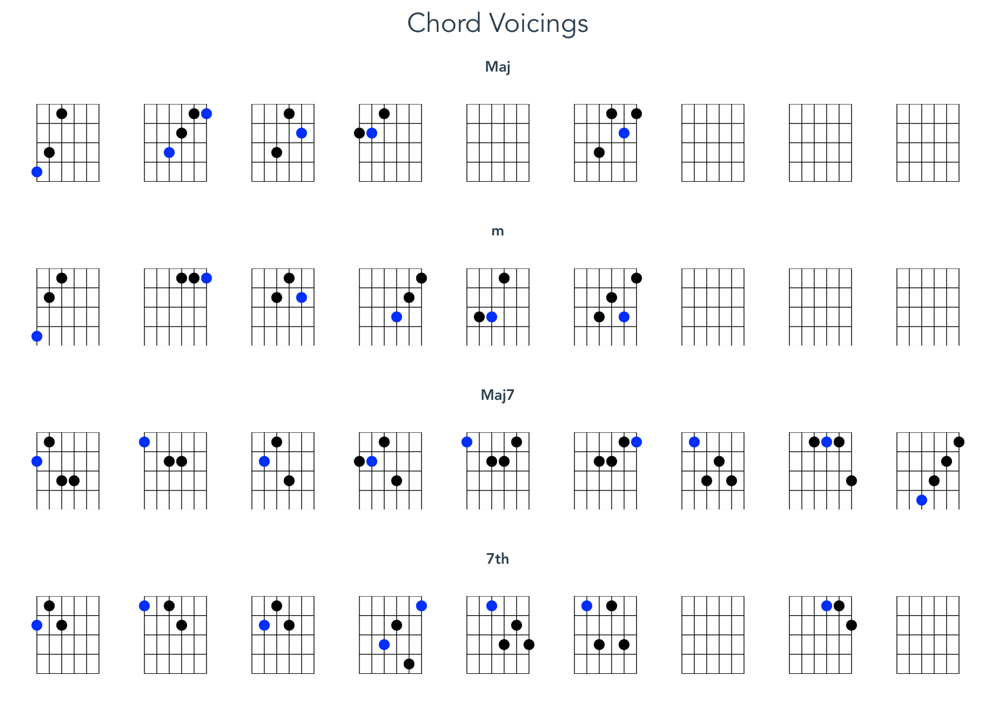
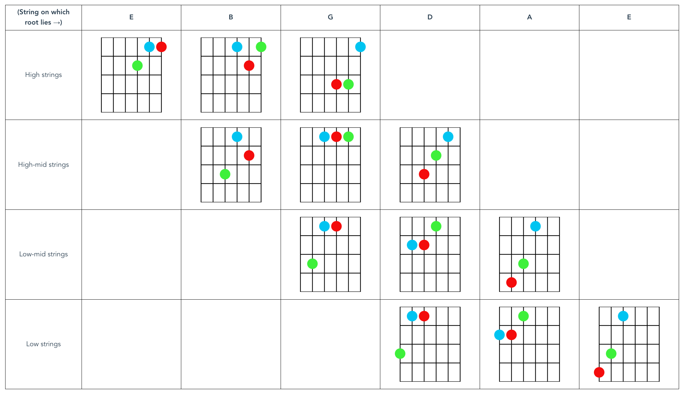

# Music Theory for Guitar

I built this to help me visualize music theoretical relationships on the guitar, and to find new chord voicings. It helped me to learn a lot more about music theory than I knew before (which was close to nothing).

## Screenshots







## Project setup

```
yarn install
```

### Compiles and hot-reloads for development

```
yarn serve
```

### Compiles and minifies for production

```
yarn build
```

### Lints and fixes files

```
yarn lint
```

### Customize configuration

See [Configuration Reference](https://cli.vuejs.org/config/).
